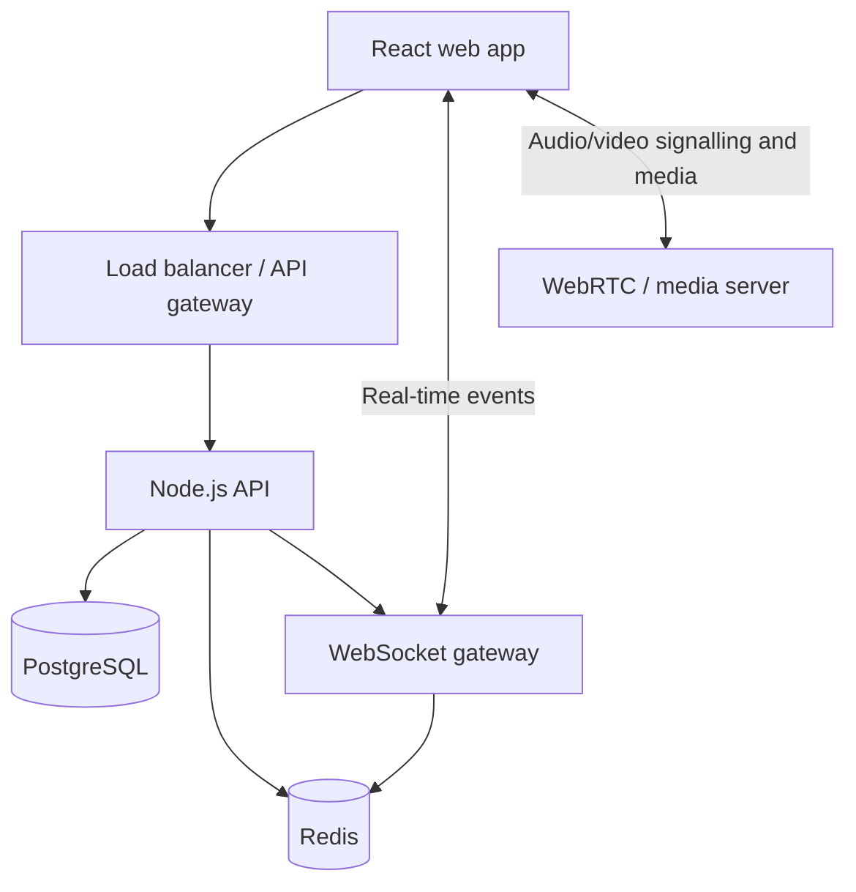

# Omeet: High-Level Design

## 1. Purpose

Omeet is a hierarchical communication platform. It models each organization's
reporting structure as a tree and uses that tree to govern meeting communication.

The central rule is: **a communication action is evaluated in the context of the
organization hierarchy and the meeting's moderation rules.**

## 2. Scope of the first version (MVP)

The MVP should prove that the hierarchy and permission model work correctly.

In scope:

- Sign up and log in.
- Create an organization.
- Add members through invitations.
- Maintain a manager-to-member reporting tree.
- Create, join, leave, and end a meeting.
- Raise a hand and grant/revoke speaking permission.
- Resolve a speaker's allowed audience by scope.
- Send real-time state updates to connected participants.

Out of scope for the MVP:

- Production-grade audio/video infrastructure.
- Recording, screen sharing, chat, AI summaries, analytics, and mobile apps.

## 3. Core concepts

### Organization hierarchy

Each person has one membership record per organization. A membership can point to
one manager membership with `manager_member_id`. The top person in an organization
has no manager. This creates a tree without hard-coding titles or levels.

```text
Organization
└── Owner / CEO
    ├── VP Engineering
    │   └── Engineering Manager
    │       ├── Engineer A
    │       └── Engineer B
    └── VP Operations
```

### Authorization versus broadcast reach

These are separate decisions:

1. **Authorization:** may this person speak or perform the requested action?
2. **Broadcast reach:** if allowed, which members receive it for the selected scope?

Keeping them separate prevents accidental over-broadcasting.

### Meeting modes (proposed)

| Mode | Intent |
| --- | --- |
| Broadcast | A moderator controls speakers; messages move through approved scopes. |
| Discussion | Participants can speak according to meeting-level rules. |
| Team | Communication is limited to a defined subtree or team. |

The MVP can start with Broadcast mode and add the other two after validating it.

## 4. System architecture



### Components

| Component | Responsibility |
| --- | --- |
| React web app | Login, organization chart, meeting UI, and permission controls. |
| Node.js API | Authentication, hierarchy rules, invitation workflow, meeting lifecycle, and authorization. |
| PostgreSQL | Durable source of truth for accounts, organizations, memberships, invitations, and meetings. |
| Redis | Short-lived real-time meeting state, cache entries, and cross-instance event coordination. |
| WebSocket gateway | Delivers presence and moderation events to users in real time. |
| WebRTC / media server | Carries audio/video; initially integrate a provider or a single media node before operating a cluster. |

## 5. Data model

| Entity | Important fields | Purpose |
| --- | --- | --- |
| `users` | `id`, `email`, `name`, `password_hash` | A person’s account. |
| `organizations` | `id`, `name`, `owner_id` | The tenant boundary. |
| `organization_members` | `id`, `organization_id`, `user_id`, `manager_member_id`, `role` | A person’s role and position in one organization. |
| `invites` | `id`, `organization_id`, `manager_member_id`, `email`, `expires_at`, `status` | Pending membership invitation. |
| `meetings` | `id`, `organization_id`, `created_by`, `status`, `started_at`, `ended_at` | A meeting’s lifecycle. |
| `meeting_participants` | `meeting_id`, `member_id`, `joined_at`, `left_at` | Attendance record. |
| `speaking_permissions` | `meeting_id`, `member_id`, `scope`, `expires_at`, `granted_by` | A time-bounded speaking grant and its audience scope. |

Recommended database constraints:

- `users.email` is unique.
- A user can have only one `organization_members` record per organization.
- A manager must belong to the same organization as the member.
- An organization member cannot be their own manager.
- Hierarchy mutations must prevent cycles (for example, a manager cannot be moved under their own report).

## 6. Broadcast-scope algorithm

Inputs: the speaker’s membership, the chosen scope, the organization tree, and
the current meeting.

1. Confirm the speaker has a current speaking permission for the meeting.
2. Confirm the requested scope is no broader than their permission allows.
3. For `ORG_WIDE`, select all active members of the organization.
4. For a depth-limited scope, traverse descendants breadth-first until the allowed depth.
5. Intersect the result with current meeting participants when sending live media or events.
6. Record an audit event with the speaker, scope, and resolved recipient count.

For early versions, recursive SQL queries or an in-memory breadth-first traversal
are sufficient. If reads become slow at scale, add a closure table or materialized
path strategy after measuring the bottleneck.

## 7. API outline

### Authentication

| Method | Path | Purpose |
| --- | --- | --- |
| `POST` | `/auth/signup` | Create an account. |
| `POST` | `/auth/login` | Start an authenticated session. |
| `GET` | `/auth/me` | Get the current user. |

### Organizations and hierarchy

| Method | Path | Purpose |
| --- | --- | --- |
| `POST` | `/organizations` | Create an organization. |
| `GET` | `/organizations/:organizationId` | Read organization details and hierarchy. |
| `POST` | `/organizations/:organizationId/invites` | Invite a person under a manager. |
| `POST` | `/organizations/:organizationId/members/:memberId/move` | Change a member’s manager. |
| `POST` | `/organizations/:organizationId/members/:memberId/promote` | Change a member’s role. |

### Meetings and moderation

| Method | Path | Purpose |
| --- | --- | --- |
| `POST` | `/meetings` | Create a meeting. |
| `POST` | `/meetings/:meetingId/join` | Join a meeting. |
| `POST` | `/meetings/:meetingId/leave` | Leave a meeting. |
| `POST` | `/meetings/:meetingId/end` | End a meeting. |
| `POST` | `/meetings/:meetingId/hands` | Raise a hand. |
| `POST` | `/meetings/:meetingId/speaking-permissions` | Grant speaking access and a scope. |
| `DELETE` | `/meetings/:meetingId/speaking-permissions/:memberId` | Revoke speaking access. |

## 8. Real-time events

Clients authenticate a WebSocket connection and subscribe only to meetings they
are allowed to join.

| Event | Sent when |
| --- | --- |
| `meeting.started` / `meeting.ended` | A meeting changes status. |
| `participant.joined` / `participant.left` | Attendance changes. |
| `hand.raised` / `hand.resolved` | A participant requests or receives a response to speak. |
| `participant.muted` / `participant.unmuted` | A moderator changes mute state. |
| `speaking_permission.changed` | A permission or broadcast scope changes. |
| `broadcast.delivered` | The server has resolved and delivered a scoped broadcast. |

## 9. Security and privacy

- Enforce organization membership on every API and WebSocket operation.
- Check hierarchy authority server-side; never trust role data sent by the browser.
- Store password hashes only, using a modern password-hashing algorithm.
- Use short-lived access tokens and secure refresh/session handling.
- Log administrative actions: invitations, hierarchy moves, meeting moderation, and permission changes.
- Apply rate limits to authentication and invitation endpoints.
- Encrypt data in transit (HTTPS/WSS) and protect production secrets outside source control.

## 10. Delivery path

1. **Foundation:** repository, product decisions, authentication, database migrations.
2. **Organization management:** create organizations, invitations, and hierarchy display.
3. **Meeting control:** meeting lifecycle, presence, hand raising, and moderation events.
4. **Hierarchy-aware communication:** scope resolution, permission rules, and audit logs.
5. **Media:** integrate audio/video and test reliability with small organizations.
6. **Scale and product depth:** Redis-backed multi-instance real-time services, analytics, chat, recordings, and summaries.

## 11. Decisions to make before coding

1. Should a member be allowed to belong to more than one organization? (Recommended: yes, eventually; start with one in the UI.)
2. Does an `ORG_WIDE` broadcast require owner-level permission, or can managers use it? (Recommended: owner-only initially.)
3. Should media be built using a managed provider first, or operated ourselves with WebRTC infrastructure? (Recommended: managed provider for the first release.)
4. Is Omeet intended first for companies, colleges, or another specific type of organization? This affects terminology, workflows, and privacy requirements.

## 12. Risks and mitigations

| Risk | Mitigation |
| --- | --- |
| Hierarchy cycles or invalid moves | Enforce database/application validation and test move operations thoroughly. |
| Permission bugs expose communication to the wrong audience | Make all authorization server-side; add audit logs and automated tests for scopes. |
| Media infrastructure becomes costly or complex | Use a managed media service while validating product-market fit. |
| Users find the hierarchy restrictive | Clearly show scope selections and allow purposeful escalation, such as raise-hand-upward requests. |
