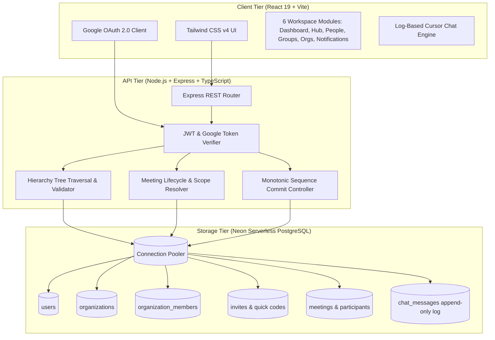

# OMeet: Hierarchical Enterprise Collaboration & Meeting Platform 🏢⚡

<div align="center">

[](https://omeet-one.vercel.app/login)

[](https://react.dev/)
[](https://www.typescriptlang.org/)
[](https://tailwindcss.com/)
[](https://vitejs.dev/)
[](https://nodejs.org/)
[](https://expressjs.com/)
[](https://neon.tech/)
[](https://developers.google.com/identity)

**A next-generation enterprise collaboration platform where communication strictly follows the organizational reporting structure—eliminating noisy meetings and information overload through depth-scoped broadcasts and role-governed moderation.**

[Live Demo](https://omeet-one.vercel.app/login) • [Core Innovation](#-the-core-innovation) • [Key Features](#-key-features) • [Architecture](#-system-architecture) • [Communication Scopes](#-hierarchical-communication-scopes) • [Quickstart](#-quickstart--local-setup) • [Documentation Hub](#-documentation-hub)

</div>

---

## 💡 The Core Innovation

In traditional meeting and communication tools (Zoom, Microsoft Teams, Slack), conversations are flat and chaotic: anyone can interrupt everyone, and broadcasts indiscriminately blast unrelated departments.

**OMeet models an organization as a dynamic hierarchical tree.** Communication rights, meeting moderation, and broadcast distribution are strictly governed by the reporting structure:

> **Core Philosophy:** *A communication action is evaluated in the context of the organizational hierarchy and the meeting's moderation rules.*

```text
                     [ Organization Owner / CEO ]
                                  │
         ┌────────────────────────┴────────────────────────┐
         ▼                                                 ▼
[ VP of Engineering ]                             [ VP of Operations ]
         │                                                 │
   ┌─────┴──────────────┐                            ┌─────┴─────┐
   ▼                    ▼                            ▼           ▼
[ Eng Manager ]    [ Design Manager ]           [ Ops Lead ] [ Logistics ]
   │
   ├─► Engineer A
   └─► Engineer B
```

* **Targeted Scoping:** When the **VP of Engineering** broadcasts at `DEPTH_2`, the message reaches the *Engineering Manager, Design Manager, Engineer A, and Engineer B*—leaving *VP Operations* and the rest of the company uninterrupted.
* **Separation of Authorization vs. Reach:** OMeet independently verifies *May this person speak?* before determining *Who is eligible to receive this broadcast?*, preventing accidental over-broadcasting.

---

## 🌟 Key Features

* 🏢 **Hierarchical Organization Engine:** Multi-tenant organization creation with atomic multi-table PostgreSQL transactions, cycle-preventing manager-report trees, and dynamic dashboard carousels.
* 📡 **Depth-Scoped Broadcasts:** Dynamic cascading audience resolution (`SELF`, `DIRECT_REPORTS`, `DEPTH_2`, `DEPTH_3`, `ORG_WIDE`) powered by recursive hierarchy traversal.
* 💬 **High-Throughput Log-Based Chat:** Append-only commit log with monotonic sequence numbers (`seq`), reverse cursor pagination (20 messages per batch), and seamless prepend loading without layout shifting.
* 👥 **Participant & Invitee State Separation:** Invited team members remain pending invitees until explicitly joining; dynamic roster enrollment, host-only initial attendance, and active filtering (`left_at IS NULL`).
* 🟢 **Live Synchronized Meeting Badging:** Pulsating `● LIVE NOW` badges and one-click "Join Live" CTA synchronized via polling across the Home Meetings Hub and Organization Workspaces.
* 🔔 **Dual-Stream Notification Center:** Dedicated Received & Sent invitation streams, real-time unread badges, and zero-redirect in-app acceptance with automatic organization provisioning.
* 🔑 **Branded Quick-Share Codes:** Expiring `OM-XXXXXX` invite codes with cryptographic collision resistance and account-exclusive redemption.
* 🛡️ **Enterprise Security & Auth:** Google OAuth 2.0 single-tap login, automatic profile provisioning, live unique username validation, and connection-pooled SSL PostgreSQL.

---

## 🏗️ System Architecture



---

## 🧭 Hierarchical Communication Scopes

| Scope | Recipient Radius | Typical Enterprise Use Case |
| :--- | :--- | :--- |
| `SELF` | The speaker only | Private notes, dictation, personal draft logs during a meeting. |
| `DIRECT_REPORTS` | Immediate subordinates ($1$ level down) | Team leads aligning directly with sub-leads on task assignments. |
| `DEPTH_2` | Direct reports + their direct reports ($2$ levels) | Engineering Directors briefing managers and line engineers. |
| `DEPTH_3` | Subtree up to $3$ tiers below the speaker | VPs delivering tactical updates across multiple divisions. |
| `ORG_WIDE` | Entire active organization membership | All-Hands, town halls, emergency announcements by Executive Leadership. |

---

## 👥 Role-Based Access Control (RBAC)

| Role | Permissions & Responsibilities |
| :--- | :--- |
| **Organization Owner** | Creates tenant organization, controls billing & settings, assigns executive managers, and transfers ownership. |
| **Manager** | Invites and structures subordinates in their reporting subtree; initiates and moderates department meetings. |
| **Employee** | Participates in meetings within their scope, submits raise-hand requests to speak, and interacts in personal/group chats. |

---

## ⚙️ Quickstart & Local Setup

### Prerequisites
* **Node.js 18.x or higher**
* **npm 9.x or higher**
* A free [Neon Serverless PostgreSQL](https://neon.tech/) account (or local PostgreSQL 14+)
* Google Cloud Console OAuth 2.0 Client ID

---

### 1. Clone the Repository
```bash
git clone https://github.com/CeilSenseiCommits/Omeet.git
cd Omeet
```

---

### 2. Backend Setup
```bash
cd backend
npm install
```

Create a `.env` file in the `backend/` directory:
```env
PORT=5000
DATABASE_URL=postgresql://<user>:<password>@<neon-host>/<dbname>?sslmode=require
GOOGLE_CLIENT_ID=your-google-client-id.apps.googleusercontent.com
JWT_SECRET=your-super-secure-jwt-secret-key
FRONTEND_URL=http://localhost:5173
```

Run database migrations to initialize tables:
```bash
npm run migrate
```

Start the backend development server:
```bash
npm run dev
# Server running on http://localhost:5000
```

---

### 3. Frontend Setup
In a new terminal window:
```bash
cd ../frontend
npm install
```

Create a `.env` file in the `frontend/` directory:
```env
VITE_API_URL=http://localhost:5000/api
VITE_GOOGLE_CLIENT_ID=your-google-client-id.apps.googleusercontent.com
```

Start the Vite development server:
```bash
npm run dev
# App running on http://localhost:5173
```

---

## 📚 Documentation Hub

The repository includes enterprise-grade specifications and technical design documents:

* 📖 **[Master System Documentation](./docs/DOCUMENTATION.md)** — Exhaustive overview of all backend and frontend subsystems, security protocols, and operational guides.
* 🗄️ **[Database Schema & Architecture](./docs/DATABASE_SCHEMA.md)** — Relational entity models, indexing strategies, constraints, and migration specs.
* 🔌 **[API Contracts](./docs/API_CONTRACTS.md)** — Complete REST endpoint definitions, request/response payloads, and status codes.
* 🎨 **[Frontend Specification](./docs/FRONTEND_SPEC.md)** — UI/UX layouts, state machines, viewport containment rules, and styling tokens.
* 🏛️ **[High-Level Design (HLD)](./HLD.md)** — Architectural design, scope resolution algorithms, and distributed real-time vision.
* 📜 **[Changelog & Progress Tracker](./docs/CHANGELOG.md)** — Complete chronological history of feature deliveries and architectural revisions.

---

## 🗺️ Project Roadmap

- [x] Google OAuth 2.0 authentication & dynamic user profiles
- [x] Multi-tenant organization creation & cycle-preventing manager reporting trees
- [x] Log-based monotonic chat with reverse cursor pagination
- [x] Meeting creation, invitee state separation, and dynamic live roster sync
- [x] Dual-stream notification center with frictionless in-app acceptance
- [ ] WebSocket gateway for sub-millisecond presence and hand-raising events
- [ ] WebRTC media server integration for hierarchical audio/video broadcasting
- [ ] AI-driven meeting summarization and action-item generation

---

## 📄 License

This project is proprietary and confidential. All rights reserved &copy; 2026 OMeet.
