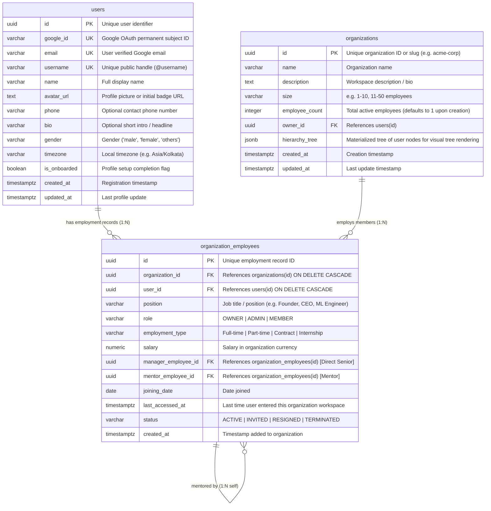

# OMeet Database Schema & Architecture Specification

This document details the complete relational database schema, table structures, column definitions, constraints, indexing strategies, and data creation workflows for the **OMeet** platform.

---

## 1. Relational Entity Relationship Diagram (ERD)



---

## 2. Table Definitions & Column Specifications

### Table 1: `users`
Represents registered user accounts authenticated via Google OAuth 2.0.

> **Full Documentation & Walkthrough:** See [DOCUMENTATION.md — 1. Authentication, Account Creation & User Onboarding](./DOCUMENTATION.md#1-authentication-account-creation--user-onboarding) for the detailed user onboarding journey, field behaviors, and validation rules.

#### SQL Table Schema (DDL):
```sql
CREATE TABLE users (
    -- Unique system identifier
    id                  UUID PRIMARY KEY DEFAULT gen_random_uuid(),

    -- Google OAuth identity
    google_id           VARCHAR(255) UNIQUE NOT NULL,       -- Google permanent subject ID (`sub`)
    email               VARCHAR(255) UNIQUE NOT NULL,       -- Verified Google email address

    -- Public profile & identity
    username            VARCHAR(50) UNIQUE NOT NULL,        -- Custom handle (e.g. "suryansh_07")
    name                VARCHAR(255) NOT NULL,              -- Full display name
    avatar_url          TEXT NOT NULL,                      -- Google Photo OR initial badge URL
    phone               VARCHAR(20) NULLABLE,               -- Optional phone number with country code
    bio                 VARCHAR(255) NULLABLE,              -- Optional brief headline / intro
    gender              VARCHAR(20) NULLABLE,               -- Gender: 'male' | 'female' | 'others'
    timezone            VARCHAR(64) NOT NULL DEFAULT 'UTC', -- Local timezone (e.g. "Asia/Kolkata")

    -- Onboarding state & lifecycle timestamps
    is_onboarded        BOOLEAN NOT NULL DEFAULT FALSE,     -- TRUE once username & setup completed
    created_at          TIMESTAMPTZ NOT NULL DEFAULT NOW(),
    updated_at          TIMESTAMPTZ NOT NULL DEFAULT NOW()
);

-- Fast lookup indexes
CREATE UNIQUE INDEX idx_users_google_id ON users(google_id);
CREATE UNIQUE INDEX idx_users_email ON users(email);
CREATE UNIQUE INDEX idx_users_username ON users(LOWER(username));
```

#### Column Details & Descriptions:
| Column Name | Data Type | Constraints | Description |
| :--- | :--- | :--- | :--- |
| `id` | `UUID` / `VARCHAR` | `PRIMARY KEY` | Globally unique user identifier. |
| `google_id` | `VARCHAR(255)` | `UNIQUE`, `NOT NULL` | Google OAuth subject ID (`sub`). Immutable anchor that never changes even if user changes their email. |
| `email` | `VARCHAR(255)` | `UNIQUE`, `NOT NULL` | User's verified Google email address. |
| `username` | `VARCHAR(50)` | `UNIQUE`, `NOT NULL` | Unique public handle (e.g. `@suryansh`). Real-time availability checked (Red if taken, Green if available). |
| `name` | `VARCHAR(255)` | `NOT NULL` | Full display name (pre-filled from Google, editable). |
| `avatar_url` | `TEXT` | `NOT NULL` | Profile picture URL (Google Photo OR initials badge fallback). |
| `phone` | `VARCHAR(20)` | `NULLABLE` | Optional contact phone number with country code. |
| `bio` | `VARCHAR(255)` | `NULLABLE` | Optional 1-2 sentence intro / headline. |
| `gender` | `VARCHAR(20)` | `NULLABLE` | Gender identity (`male`, `female`, `others`). |
| `timezone` | `VARCHAR(64)` | `NOT NULL DEFAULT 'UTC'` | User local timezone (auto-detected via browser). Essential for meeting schedules. |
| `is_onboarded` | `BOOLEAN` | `NOT NULL DEFAULT FALSE` | Flag indicating whether first-time profile setup is complete. |
| `created_at` | `TIMESTAMPTZ` | `DEFAULT NOW()` | Account creation date. |
| `updated_at` | `TIMESTAMPTZ` | `DEFAULT NOW()` | Last update timestamp. |

#### Quick FAQ & Design Notes:
* **Why `google_id` vs `email`?** `google_id` is an immutable 21-digit number assigned by Google. If a user or company updates their email address, their `google_id` remains the same so their account is never lost.
* **Why `is_onboarded`?** Distinguishes new Google sign-ups (who need to pick their `@username`, photo, and bio) from returning users who should go straight to the Dashboard.
* **Why `timezone`?** Needed to calculate correct meeting times and member availability across distributed global teams. Auto-detected from browser with zero typing.

---

### Table 2: `organizations`
Represents organizations, companies, and workspaces.

> **Full Documentation & Walkthrough:** See [DOCUMENTATION.md — 3. Organizations & Employee Hierarchy Architecture](./DOCUMENTATION.md#3-organizations--employee-hierarchy-architecture-date-2026-09-05).

#### SQL Table Schema (DDL):
```sql
CREATE TABLE organizations (
    id              UUID PRIMARY KEY DEFAULT gen_random_uuid(),
    name            VARCHAR(255) NOT NULL,
    brief           VARCHAR(255) NULL,                        -- Optional one-liner intro / tagline
    description     TEXT NULL,
    size            VARCHAR(50) NULL,                         -- e.g. "1-10", "11-50"
    employee_count  INTEGER NOT NULL DEFAULT 1,               -- Total active count (defaults to 1 for creator)
    owner_id        UUID NOT NULL REFERENCES users(id) ON DELETE CASCADE,
    created_at      TIMESTAMPTZ NOT NULL DEFAULT NOW(),
    updated_at      TIMESTAMPTZ NOT NULL DEFAULT NOW()
);

CREATE INDEX idx_organizations_owner ON organizations(owner_id);
```

#### Column Details:
| Column Name | Data Type | Constraints | Description |
| :--- | :--- | :--- | :--- |
| `id` | `UUID` | `PRIMARY KEY` | Globally unique organization ID. |
| `name` | `VARCHAR(255)` | `NOT NULL` | Organization / company name. |
| `brief` | `VARCHAR(255)` | `NULLABLE` | Optional concise intro / tagline (max 255 chars) shown on organization cards & previews. |
| `description` | `TEXT` | `NULLABLE` | Full workspace bio, mission, or description. |
| `size` | `VARCHAR(50)` | `NULLABLE` | Expected organization size bracket (e.g. "1-10 employees"). |
| **`employee_count`** | `INTEGER` | `NOT NULL DEFAULT 1` | **Total active employees count in the organization. Defaults to 1 upon creation.** |
| `owner_id` | `UUID` | `FK -> users(id)` | User ID of the creator/owner. |
| `created_at` | `TIMESTAMPTZ` | `DEFAULT NOW()` | Timestamp when organization was created. |
| `updated_at` | `TIMESTAMPTZ` | `DEFAULT NOW()` | Last updated timestamp. |

---

### Table 3: `organization_employees` (The Employment & Junction Table)
Represents a user's employment, position, and reporting hierarchy within a specific organization.

#### SQL Table Schema (DDL):
```sql
CREATE TABLE organization_employees (
    id                  UUID PRIMARY KEY DEFAULT gen_random_uuid(),
    organization_id     UUID NOT NULL REFERENCES organizations(id) ON DELETE CASCADE,
    user_id             UUID NOT NULL REFERENCES users(id) ON DELETE CASCADE,
    manager_employee_id UUID NULL REFERENCES organization_employees(id) ON DELETE SET NULL,
    position            VARCHAR(100) NOT NULL,
    role                VARCHAR(50) NOT NULL DEFAULT 'MEMBER',
    salary              NUMERIC(12, 2) NULL,
    joining_date        DATE NOT NULL DEFAULT CURRENT_DATE,
    resignation_date    DATE NULL,
    last_accessed_at    TIMESTAMPTZ NOT NULL DEFAULT NOW(),
    status              VARCHAR(20) NOT NULL DEFAULT 'ACTIVE',
    created_at          TIMESTAMPTZ NOT NULL DEFAULT NOW(),
    updated_at          TIMESTAMPTZ NOT NULL DEFAULT NOW(),
    CONSTRAINT uq_org_user UNIQUE (organization_id, user_id)
);

CREATE INDEX idx_org_employees_user ON organization_employees(user_id);
CREATE INDEX idx_org_employees_org ON organization_employees(organization_id);
CREATE INDEX idx_org_employees_manager ON organization_employees(manager_employee_id);
```

#### Column Details:
| Column Name | Data Type | Constraints | Description |
| :--- | :--- | :--- | :--- |
| `id` | `UUID` | `PRIMARY KEY` | Unique employment record ID. |
| `organization_id` | `UUID` | `FK -> organizations(id)` | Organization the employee belongs to. |
| `user_id` | `UUID` | `FK -> users(id)` | User who is employed. |
| `manager_employee_id` | `UUID` | `FK -> organization_employees(id)` | Direct senior / immediate manager. Automatically determines juniors! |
| `position` | `VARCHAR(100)` | `NOT NULL` | Job title (e.g. "Founder", "CEO", "ML Engineer"). |
| `role` | `VARCHAR(50)` | `DEFAULT 'MEMBER'` | Access role: `OWNER`, `ADMIN`, `MEMBER`. |
| `salary` | `NUMERIC(12, 2)` | `NULLABLE` | Salary amount for this position. |
| `joining_date` | `DATE` | `DEFAULT CURRENT_DATE` | Date user joined organization. |
| `resignation_date` | `DATE` | `NULLABLE` | Date user left/resigned (`NULL` while active). |
| `last_accessed_at` | `TIMESTAMPTZ` | `DEFAULT NOW()` | **Last time user entered this organization workspace**. |
| `status` | `VARCHAR(20)` | `DEFAULT 'ACTIVE'` | `ACTIVE`, `INVITED`, `RESIGNED`, `TERMINATED`. |
| `created_at` | `TIMESTAMPTZ` | `DEFAULT NOW()` | Record creation timestamp. |
| `updated_at` | `TIMESTAMPTZ` | `DEFAULT NOW()` | Last update timestamp. |

---

## 3. Database Constraints & Indexing

```sql
-- Guarantee user can only have ONE employee record per organization:
ALTER TABLE organization_employees 
ADD CONSTRAINT uq_org_user UNIQUE (organization_id, user_id);

-- High-speed B-Tree index for finding all organizations a user belongs to in < 0.5ms:
CREATE INDEX idx_org_employees_user_id ON organization_employees(user_id);

-- High-speed B-Tree index for finding all employees belonging to an organization:
CREATE INDEX idx_org_employees_org_id ON organization_employees(organization_id);

-- Hierarchy indexes:
CREATE INDEX idx_org_employees_manager ON organization_employees(manager_employee_id);
CREATE INDEX idx_org_employees_mentor ON organization_employees(mentor_employee_id);
```

---

## 4. Organization Creation Lifecycle (Atomic Transaction)

When a user completes the **Create Organization** form and clicks Submit:

```mermaid
sequenceDiagram
    autonumber
    actor Creator as User (Creator)
    participant API as Backend API (POST /api/organizations)
    participant DB as PostgreSQL Database

    Creator->>API: POST /api/organizations { name, description, size, position }
    Note over API: Derive creator userId from authenticated session
    
    rect rgb(20, 20, 30)
    Note over API,DB: BEGIN ATOMIC DATABASE TRANSACTION
    API->>DB: 1. INSERT INTO organizations (name, description, size, employee_count = 1, owner_id)
    DB-->>API: Returns new organization_id
    
    API->>DB: 2. INSERT INTO organization_employees (organization_id, user_id, position, role = 'OWNER', status = 'ACTIVE', last_accessed_at = NOW())
    DB-->>API: Returns new employee_id

    API->>DB: 3. UPDATE organizations SET hierarchy_tree = JSON containing creator as root
    DB-->>API: COMMIT TRANSACTION
    end

    API-->>Creator: 201 Created { organizationId, name, ownerId, ... }
    Note over Creator: Frontend redirects to /organization/:organizationId or Dashboard
```



### Resulting Database Records:
1. **New `organizations` record created**:
   - `id`: e.g. `org_98234`
   - `name`: user entered name
   - `description`: user entered description
   - `size`: user selected size
   - **`employee_count`**: **`1`**
   - `owner_id`: creator's user ID
2. **New `organization_employees` record created**:
   - `organization_id`: new organization ID
   - `user_id`: creator's user ID
   - `position`: creator's position (e.g. "Founder & CEO")
   - `role`: **`'OWNER'`**
   - `status`: **`'ACTIVE'`**
   - `last_accessed_at`: **`NOW()`**
   - `joining_date`: **`CURRENT_DATE`**
3. **Immediate Home Page update**:
   - Because `organization_employees` has a row linking the creator to the new organization, when the creator goes to the Home Page, the new organization card immediately appears!
