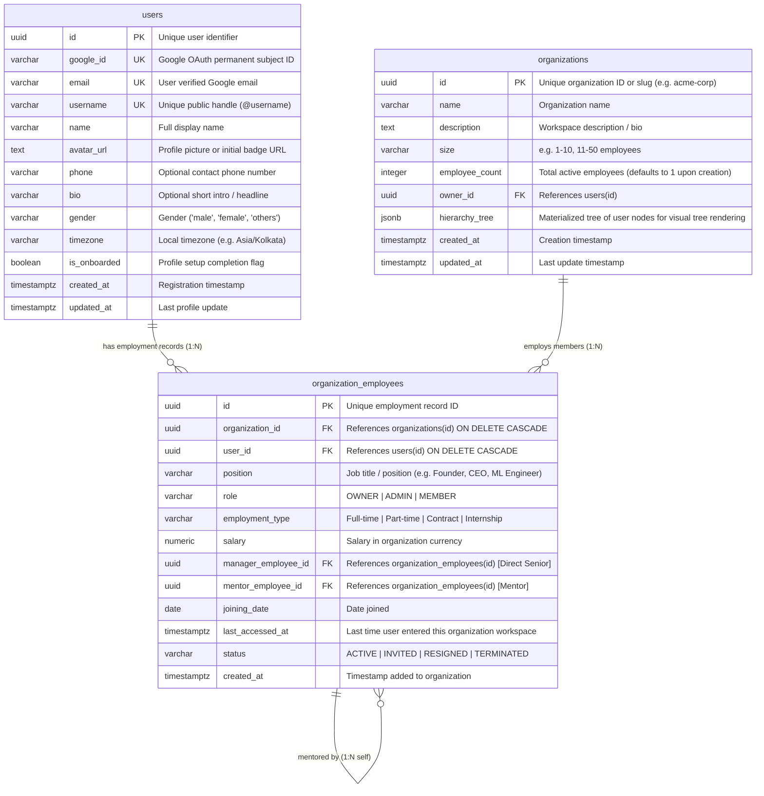

# OMeet Database Schema & Architecture Specification

This document details the complete relational database schema, table structures, column definitions, constraints, indexing strategies, and data creation workflows for the **OMeet** platform.

---

## 1. Relational Entity Relationship Diagram (ERD)



---

## 2. Table Definitions & Column Specifications

### Table 1: `users`
Represents registered user accounts authenticated via Google OAuth 2.0.

> **Full Documentation & Walkthrough:** See [DOCUMENTATION.md — 1. Authentication, Account Creation & User Onboarding](./DOCUMENTATION.md#1-authentication-account-creation--user-onboarding) for the detailed user onboarding journey, field behaviors, and validation rules.

#### SQL Table Schema (DDL):
```sql
CREATE TABLE users (
    -- Unique system identifier
    id                  UUID PRIMARY KEY DEFAULT gen_random_uuid(),

    -- Google OAuth identity
    google_id           VARCHAR(255) UNIQUE NOT NULL,       -- Google permanent subject ID (`sub`)
    email               VARCHAR(255) UNIQUE NOT NULL,       -- Verified Google email address

    -- Public profile & identity
    username            VARCHAR(50) UNIQUE NOT NULL,        -- Custom handle (e.g. "suryansh_07")
    name                VARCHAR(255) NOT NULL,              -- Full display name
    avatar_url          TEXT NOT NULL,                      -- Google Photo OR initial badge URL
    phone               VARCHAR(20) NULLABLE,               -- Optional phone number with country code
    bio                 VARCHAR(255) NULLABLE,              -- Optional brief headline / intro
    gender              VARCHAR(20) NULLABLE,               -- Gender: 'male' | 'female' | 'others'
    timezone            VARCHAR(64) NOT NULL DEFAULT 'UTC', -- Local timezone (e.g. "Asia/Kolkata")

    -- Onboarding state & lifecycle timestamps
    is_onboarded        BOOLEAN NOT NULL DEFAULT FALSE,     -- TRUE once username & setup completed
    created_at          TIMESTAMPTZ NOT NULL DEFAULT NOW(),
    updated_at          TIMESTAMPTZ NOT NULL DEFAULT NOW()
);

-- Fast lookup indexes
CREATE UNIQUE INDEX idx_users_google_id ON users(google_id);
CREATE UNIQUE INDEX idx_users_email ON users(email);
CREATE UNIQUE INDEX idx_users_username ON users(LOWER(username));
```

#### Column Details & Descriptions:
| Column Name | Data Type | Constraints | Description |
| :--- | :--- | :--- | :--- |
| `id` | `UUID` / `VARCHAR` | `PRIMARY KEY` | Globally unique user identifier. |
| `google_id` | `VARCHAR(255)` | `UNIQUE`, `NOT NULL` | Google OAuth subject ID (`sub`). Immutable anchor that never changes even if user changes their email. |
| `email` | `VARCHAR(255)` | `UNIQUE`, `NOT NULL` | User's verified Google email address. |
| `username` | `VARCHAR(50)` | `UNIQUE`, `NOT NULL` | Unique public handle (e.g. `@suryansh`). Real-time availability checked (Red if taken, Green if available). |
| `name` | `VARCHAR(255)` | `NOT NULL` | Full display name (pre-filled from Google, editable). |
| `avatar_url` | `TEXT` | `NOT NULL` | Profile picture URL (Google Photo OR initials badge fallback). |
| `phone` | `VARCHAR(20)` | `NULLABLE` | Optional contact phone number with country code. |
| `bio` | `VARCHAR(255)` | `NULLABLE` | Optional 1-2 sentence intro / headline. |
| `gender` | `VARCHAR(20)` | `NULLABLE` | Gender identity (`male`, `female`, `others`). |
| `timezone` | `VARCHAR(64)` | `NOT NULL DEFAULT 'UTC'` | User local timezone (auto-detected via browser). Essential for meeting schedules. |
| `is_onboarded` | `BOOLEAN` | `NOT NULL DEFAULT FALSE` | Flag indicating whether first-time profile setup is complete. |
| `created_at` | `TIMESTAMPTZ` | `DEFAULT NOW()` | Account creation date. |
| `updated_at` | `TIMESTAMPTZ` | `DEFAULT NOW()` | Last update timestamp. |

#### Quick FAQ & Design Notes:
* **Why `google_id` vs `email`?** `google_id` is an immutable 21-digit number assigned by Google. If a user or company updates their email address, their `google_id` remains the same so their account is never lost.
* **Why `is_onboarded`?** Distinguishes new Google sign-ups (who need to pick their `@username`, photo, and bio) from returning users who should go straight to the Dashboard.
* **Why `timezone`?** Needed to calculate correct meeting times and member availability across distributed global teams. Auto-detected from browser with zero typing.

---

### Table 2: `organizations`
Represents organizations, companies, and workspaces.

> **Full Documentation & Walkthrough:** See [DOCUMENTATION.md — 3. Organizations & Employee Hierarchy Architecture](./DOCUMENTATION.md#3-organizations--employee-hierarchy-architecture-date-2026-09-05).

#### SQL Table Schema (DDL):
```sql
CREATE TABLE organizations (
    id              UUID PRIMARY KEY DEFAULT gen_random_uuid(),
    name            VARCHAR(255) NOT NULL,
    brief           VARCHAR(255) NULL,                        -- Optional one-liner intro / tagline
    description     TEXT NULL,
    size            VARCHAR(50) NULL,                         -- e.g. "1-10", "11-50"
    employee_count  INTEGER NOT NULL DEFAULT 1,               -- Total active count (defaults to 1 for creator)
    owner_id        UUID NOT NULL REFERENCES users(id) ON DELETE CASCADE,
    created_at      TIMESTAMPTZ NOT NULL DEFAULT NOW(),
    updated_at      TIMESTAMPTZ NOT NULL DEFAULT NOW()
);

CREATE INDEX idx_organizations_owner ON organizations(owner_id);
```

#### Column Details:
| Column Name | Data Type | Constraints | Description |
| :--- | :--- | :--- | :--- |
| `id` | `UUID` | `PRIMARY KEY` | Globally unique organization ID. |
| `name` | `VARCHAR(255)` | `NOT NULL` | Organization / company name. |
| `brief` | `VARCHAR(255)` | `NULLABLE` | Optional concise intro / tagline (max 255 chars) shown on organization cards & previews. |
| `description` | `TEXT` | `NULLABLE` | Full workspace bio, mission, or description. |
| `size` | `VARCHAR(50)` | `NULLABLE` | Expected organization size bracket (e.g. "1-10 employees"). |
| **`employee_count`** | `INTEGER` | `NOT NULL DEFAULT 1` | **Total active employees count in the organization. Defaults to 1 upon creation.** |
| `owner_id` | `UUID` | `FK -> users(id)` | User ID of the creator/owner. |
| `created_at` | `TIMESTAMPTZ` | `DEFAULT NOW()` | Timestamp when organization was created. |
| `updated_at` | `TIMESTAMPTZ` | `DEFAULT NOW()` | Last updated timestamp. |

---

### Table 3: `organization_employees` (The Employment & Junction Table)
Represents a user's employment, position, and reporting hierarchy within a specific organization.

#### SQL Table Schema (DDL):
```sql
CREATE TABLE organization_employees (
    id                  UUID PRIMARY KEY DEFAULT gen_random_uuid(),
    organization_id     UUID NOT NULL REFERENCES organizations(id) ON DELETE CASCADE,
    user_id             UUID NOT NULL REFERENCES users(id) ON DELETE CASCADE,
    manager_employee_id UUID NULL REFERENCES organization_employees(id) ON DELETE SET NULL,
    position            VARCHAR(100) NOT NULL,
    role                VARCHAR(50) NOT NULL DEFAULT 'MEMBER',
    salary              NUMERIC(12, 2) NULL,
    has_permission      BOOLEAN NOT NULL DEFAULT FALSE,       -- TRUE for OWNER; controls member invite permission
    joining_date        DATE NOT NULL DEFAULT CURRENT_DATE,
    resignation_date    DATE NULL,
    last_accessed_at    TIMESTAMPTZ NOT NULL DEFAULT NOW(),
    status              VARCHAR(20) NOT NULL DEFAULT 'ACTIVE',
    created_at          TIMESTAMPTZ NOT NULL DEFAULT NOW(),
    updated_at          TIMESTAMPTZ NOT NULL DEFAULT NOW(),
    CONSTRAINT uq_org_user UNIQUE (organization_id, user_id)
);

CREATE INDEX idx_org_employees_user ON organization_employees(user_id);
CREATE INDEX idx_org_employees_org ON organization_employees(organization_id);
CREATE INDEX idx_org_employees_manager ON organization_employees(manager_employee_id);
```

#### Column Details:
| Column Name | Data Type | Constraints | Description |
| :--- | :--- | :--- | :--- |
| `id` | `UUID` | `PRIMARY KEY` | Unique employment record ID. |
| `organization_id` | `UUID` | `FK -> organizations(id)` | Organization the employee belongs to. |
| `user_id` | `UUID` | `FK -> users(id)` | User who is employed. |
| `manager_employee_id` | `UUID` | `FK -> organization_employees(id)` | Direct senior / immediate manager. Automatically determines juniors! |
| `position` | `VARCHAR(100)` | `NOT NULL` | Job title (e.g. "Founder", "CEO", "ML Engineer"). |
| `role` | `VARCHAR(50)` | `DEFAULT 'MEMBER'` | Access role: `OWNER`, `ADMIN`, `MEMBER`. |
| `salary` | `NUMERIC(12, 2)` | `NULLABLE` | Salary amount for this position. |
| **`has_permission`** | `BOOLEAN` | `NOT NULL DEFAULT FALSE` | **Permission gate for inviting new members. Automatically TRUE for OWNER.** |
| `joining_date` | `DATE` | `DEFAULT CURRENT_DATE` | Date user joined organization. |
| `resignation_date` | `DATE` | `NULLABLE` | Date user left/resigned (`NULL` while active). |
| `last_accessed_at` | `TIMESTAMPTZ` | `DEFAULT NOW()` | **Last time user entered this organization workspace**. |
| `status` | `VARCHAR(20)` | `DEFAULT 'ACTIVE'` | `ACTIVE`, `INVITED`, `RESIGNED`, `TERMINATED`. |
| `created_at` | `TIMESTAMPTZ` | `DEFAULT NOW()` | Record creation timestamp. |
| `updated_at` | `TIMESTAMPTZ` | `DEFAULT NOW()` | Last update timestamp. |

---

### Table 4: `organization_invitations`
Represents pending and historical in-app invitations between registered OMeet users and workspaces.

#### SQL Table Schema (DDL):
```sql
CREATE TABLE organization_invitations (
    id                  UUID PRIMARY KEY DEFAULT gen_random_uuid(),
    invite_code         VARCHAR(20) UNIQUE NOT NULL,          -- Branded HR quick-share code (e.g. "OM-7K9P2X")
    organization_id     UUID NOT NULL REFERENCES organizations(id) ON DELETE CASCADE,
    inviter_user_id     UUID NOT NULL REFERENCES users(id) ON DELETE CASCADE,
    inviter_employee_id UUID NOT NULL REFERENCES organization_employees(id) ON DELETE CASCADE,
    invitee_user_id     UUID NOT NULL REFERENCES users(id) ON DELETE CASCADE,
    position            VARCHAR(100) NOT NULL,
    department          VARCHAR(100) NULL,
    manager_employee_id UUID NOT NULL REFERENCES organization_employees(id) ON DELETE RESTRICT,
    role                VARCHAR(50) NOT NULL DEFAULT 'MEMBER',
    salary              NUMERIC(12, 2) NULL,
    status              VARCHAR(20) NOT NULL DEFAULT 'PENDING',
    expires_at          TIMESTAMPTZ NOT NULL DEFAULT (NOW() + INTERVAL '7 days'),
    created_at          TIMESTAMPTZ NOT NULL DEFAULT NOW(),
    updated_at          TIMESTAMPTZ NOT NULL DEFAULT NOW()
);

CREATE UNIQUE INDEX idx_invitations_code ON organization_invitations(invite_code);
CREATE INDEX idx_invitations_invitee ON organization_invitations(invitee_user_id);
CREATE INDEX idx_invitations_org ON organization_invitations(organization_id);
CREATE UNIQUE INDEX uq_org_pending_invite 
    ON organization_invitations(organization_id, invitee_user_id) 
    WHERE status = 'PENDING';
```

#### Column Details:
| Column Name | Data Type | Constraints | Description |
| :--- | :--- | :--- | :--- |
| `id` | `UUID` | `PRIMARY KEY` | Unique invitation record ID. |
| **`invite_code`** | `VARCHAR(20)` | `UNIQUE, NOT NULL` | **Branded quick-access code (`OM-XXXXXX`) for HRs to share directly.** |
| `organization_id` | `UUID` | `FK -> organizations(id)` | Target organization. |
| `inviter_user_id` | `UUID` | `FK -> users(id)` | User who created the invitation. |
| `inviter_employee_id` | `UUID` | `FK -> organization_employees(id)` | Employment record of the inviter. |
| `invitee_user_id` | `UUID` | `FK -> users(id)` | **Direct FK to the registered OMeet user being invited.** |
| `position` | `VARCHAR(100)` | `NOT NULL` | Job title offered. |
| `department` | `VARCHAR(100)` | `NULLABLE` | Department name. |
| `manager_employee_id` | `UUID` | `FK -> organization_employees(id)` | **Assigned direct senior (restricted to inviter or their subordinates).** |
| `role` | `VARCHAR(50)` | `DEFAULT 'MEMBER'` | Role offered (`MEMBER` or `ADMIN`). |
| `salary` | `NUMERIC(12, 2)` | `NULLABLE` | Optional proposed salary. |
| `status` | `VARCHAR(20)` | `DEFAULT 'PENDING'` | Lifecycle: `PENDING`, `ACCEPTED`, `REJECTED`, `EXPIRED`, `CANCELLED`. |
| **`expires_at`** | `TIMESTAMPTZ` | `NOT NULL` | **Expiration timestamp chosen by HR (3, 7, 14, or 30 days).** |
| `created_at` | `TIMESTAMPTZ` | `DEFAULT NOW()` | Date invitation sent. |
| `updated_at` | `TIMESTAMPTZ` | `DEFAULT NOW()` | Date invitation accepted/rejected. |

---

## 3. Database Constraints & Indexing

```sql
-- Guarantee user can only have ONE employee record per organization:
ALTER TABLE organization_employees 
ADD CONSTRAINT uq_org_user UNIQUE (organization_id, user_id);

-- High-speed B-Tree index for finding all organizations a user belongs to in < 0.5ms:
CREATE INDEX idx_org_employees_user_id ON organization_employees(user_id);

-- High-speed B-Tree index for finding all employees belonging to an organization:
CREATE INDEX idx_org_employees_org_id ON organization_employees(organization_id);

-- Hierarchy indexes:
CREATE INDEX idx_org_employees_manager ON organization_employees(manager_employee_id);
CREATE INDEX idx_org_employees_mentor ON organization_employees(mentor_employee_id);
```

---

## 4. Organization Creation Lifecycle (Atomic Transaction)

When a user completes the **Create Organization** form and clicks Submit:

```mermaid
sequenceDiagram
    autonumber
    actor Creator as User (Creator)
    participant API as Backend API (POST /api/organizations)
    participant DB as PostgreSQL Database

    Creator->>API: POST /api/organizations { name, description, size, position }
    Note over API: Derive creator userId from authenticated session
    
    rect rgb(20, 20, 30)
    Note over API,DB: BEGIN ATOMIC DATABASE TRANSACTION
    API->>DB: 1. INSERT INTO organizations (name, description, size, employee_count = 1, owner_id)
    DB-->>API: Returns new organization_id
    
    API->>DB: 2. INSERT INTO organization_employees (organization_id, user_id, position, role = 'OWNER', status = 'ACTIVE', last_accessed_at = NOW())
    DB-->>API: Returns new employee_id

    API->>DB: 3. UPDATE organizations SET hierarchy_tree = JSON containing creator as root
    DB-->>API: COMMIT TRANSACTION
    end

    API-->>Creator: 201 Created { organizationId, name, ownerId, ... }
    Note over Creator: Frontend redirects to /organization/:organizationId or Dashboard
```



### Resulting Database Records:
1. **New `organizations` record created**:
   - `id`: e.g. `org_98234`
   - `name`: user entered name
   - `description`: user entered description
   - `size`: user selected size
   - **`employee_count`**: **`1`**
   - `owner_id`: creator's user ID
2. **New `organization_employees` record created**:
   - `organization_id`: new organization ID
   - `user_id`: creator's user ID
   - `position`: creator's position (e.g. "Founder & CEO")
   - `role`: **`'OWNER'`**
   - `status`: **`'ACTIVE'`**
   - `last_accessed_at`: **`NOW()`**
   - `joining_date`: **`CURRENT_DATE`**
3. **Immediate Home Page update**:
   - Because `organization_employees` has a row linking the creator to the new organization, when the creator goes to the Home Page, the new organization card immediately appears!

---

## 5. Invitation Acceptance Lifecycle (Atomic Transaction)

When an invitee accepts an organization invitation in the in-app Notification Center or Preview Page:

```mermaid
sequenceDiagram
    autonumber
    actor Invitee as User (Invitee)
    participant API as Backend (POST /api/invitations/:id/respond)
    participant DB as PostgreSQL Database

    Invitee->>API: POST /api/invitations/:id/respond { action: 'ACCEPT', userId }
    
    rect rgb(20, 20, 30)
    Note over API,DB: BEGIN ATOMIC DATABASE TRANSACTION
    API->>DB: 1. SELECT * FROM organization_invitations WHERE id = $1 AND invitee_user_id = $2 AND status = 'PENDING' FOR UPDATE
    DB-->>API: Return invitation record
    
    API->>DB: 2. UPDATE organization_invitations SET status = 'ACCEPTED', updated_at = NOW() WHERE id = $1
    
    API->>DB: 3. INSERT INTO organization_employees (organization_id, user_id, manager_employee_id, position, department, role, salary, status = 'ACTIVE', has_permission = FALSE)
    DB-->>API: Return new employee record
    
    API->>DB: 4. UPDATE organizations SET employee_count = employee_count + 1 WHERE id = $organization_id
    DB-->>API: COMMIT TRANSACTION
    end

    API-->>Invitee: 200 OK { message: "Invitation accepted successfully", status: "ACCEPTED" }
    Note over Invitee: Frontend dispatches 'organization-updated' event to live-refresh carousel
```



If the action is `'REJECT'`:
- `organization_invitations.status` is set to `'REJECTED'`.
- No entry is inserted into `organization_employees`.
- The invitation remains in the notification list marked with `'REJECTED'`.

---

## 6. Organization Workspace: Communication & Conversations Schema

To power the Organization Workspace sidebar (Channels, Team Groups, and Direct Messages) with live database data:

### Table 5: `conversations`
Unified conversation container supporting organizational channels, team groups, and 1-on-1 direct messages.

```sql
CREATE TABLE conversations (
    id                  UUID PRIMARY KEY DEFAULT gen_random_uuid(),
    organization_id     UUID NOT NULL REFERENCES organizations(id) ON DELETE CASCADE,
    type                VARCHAR(20) NOT NULL,                 -- 'CHANNEL' | 'GROUP' | 'DIRECT'
    name                VARCHAR(100) NULL,                    -- e.g. "general", "frontend-team" (NULL for direct messages)
    topic               VARCHAR(255) NULL,                    -- Brief room purpose or description
    is_private          BOOLEAN NOT NULL DEFAULT FALSE,       -- Public to all org members vs restricted
    created_by          UUID REFERENCES users(id) ON DELETE SET NULL,
    created_at          TIMESTAMPTZ NOT NULL DEFAULT NOW(),
    updated_at          TIMESTAMPTZ NOT NULL DEFAULT NOW()
);

CREATE INDEX idx_conversations_org ON conversations(organization_id);
CREATE INDEX idx_conversations_type ON conversations(type);
```

### Table 6: `conversation_participants`
Junction table linking employees/users to conversations, tracking membership, roles, and unread counts.

```sql
CREATE TABLE conversation_participants (
    id                  UUID PRIMARY KEY DEFAULT gen_random_uuid(),
    conversation_id     UUID NOT NULL REFERENCES conversations(id) ON DELETE CASCADE,
    user_id             UUID NOT NULL REFERENCES users(id) ON DELETE CASCADE,
    role                VARCHAR(20) NOT NULL DEFAULT 'MEMBER', -- 'OWNER' | 'ADMIN' | 'MEMBER'
    last_read_at        TIMESTAMPTZ NOT NULL DEFAULT NOW(),
    created_at          TIMESTAMPTZ NOT NULL DEFAULT NOW(),
    CONSTRAINT uq_conversation_user UNIQUE (conversation_id, user_id)
);

CREATE INDEX idx_conv_participants_user ON conversation_participants(user_id);
CREATE INDEX idx_conv_participants_conv ON conversation_participants(conversation_id);
```

#### Seed Defaults on Organization Creation:
When an organization is created, the system auto-provisions standard public channels:
1. `# general`: Organization-wide company announcements and general discussion.
2. `# random`: Casual watercooler chat.
3. Automatically enrolls the creator (Owner) as a participant in both channels.

---

## 7. Organization Meetings Schema

### Table 7: `organization_meetings`
Represents organization-scoped synchronous video/audio meetings (Live, Scheduled, and Past).

```sql
CREATE TABLE organization_meetings (
    id                  UUID PRIMARY KEY DEFAULT gen_random_uuid(),
    organization_id     UUID NULL REFERENCES organizations(id) ON DELETE CASCADE,  -- NULL for open public meetings
    conversation_id     UUID NULL REFERENCES conversations(id) ON DELETE SET NULL,
    meeting_code        VARCHAR(20) UNIQUE NOT NULL,          -- e.g. "OM-46IRFD"
    title               VARCHAR(255) NOT NULL,
    host_user_id        UUID NOT NULL REFERENCES users(id) ON DELETE CASCADE,
    status              VARCHAR(20) NOT NULL DEFAULT 'SCHEDULED', -- 'SCHEDULED' | 'LIVE' | 'ENDED'
    scope               VARCHAR(50) NOT NULL DEFAULT 'ORG_WIDE',  -- 'CUSTOM' | 'ORG_WIDE' | 'PUBLIC'
    meeting_type        VARCHAR(20) NOT NULL DEFAULT 'INSTANT',   -- 'INSTANT' | 'SCHEDULED'
    is_hierarchical     BOOLEAN NOT NULL DEFAULT FALSE,           -- Hierarchy Mode (default OFF)
    scheduled_at        TIMESTAMPTZ NOT NULL,
    started_at          TIMESTAMPTZ NULL,
    ended_at            TIMESTAMPTZ NULL,
    has_recording       BOOLEAN NOT NULL DEFAULT FALSE,
    has_ai_summary      BOOLEAN NOT NULL DEFAULT FALSE,
    created_at          TIMESTAMPTZ NOT NULL DEFAULT NOW(),
    updated_at          TIMESTAMPTZ NOT NULL DEFAULT NOW()
);

CREATE INDEX idx_org_meetings_org ON organization_meetings(organization_id);
CREATE INDEX idx_org_meetings_status ON organization_meetings(status);
CREATE INDEX idx_org_meetings_scheduled ON organization_meetings(scheduled_at);
```

### Table 8: `meeting_participants`
Tracks attendees, active session state, joined/left timestamps, and participant roles.

```sql
CREATE TABLE meeting_participants (
    id                  UUID PRIMARY KEY DEFAULT gen_random_uuid(),
    meeting_id          UUID NOT NULL REFERENCES organization_meetings(id) ON DELETE CASCADE,
    user_id             UUID NOT NULL REFERENCES users(id) ON DELETE CASCADE,
    role                VARCHAR(20) NOT NULL DEFAULT 'LISTENER', -- 'HOST' | 'SPEAKER' | 'LISTENER'
    joined_at           TIMESTAMPTZ NOT NULL DEFAULT NOW(),
    left_at             TIMESTAMPTZ NULL,                        -- Set when user leaves or meeting ends
    CONSTRAINT uq_meeting_participant UNIQUE (meeting_id, user_id)
);

CREATE INDEX idx_meeting_participants_meeting ON meeting_participants(meeting_id);
CREATE INDEX idx_meeting_participants_user ON meeting_participants(user_id);
```

### Table 9: `meeting_invitations`
Delivers in-app notifications and meeting invites with instant join actions.

```sql
CREATE TABLE meeting_invitations (
    id                  UUID PRIMARY KEY DEFAULT gen_random_uuid(),
    meeting_id          UUID NOT NULL REFERENCES organization_meetings(id) ON DELETE CASCADE,
    organization_id     UUID NULL REFERENCES organizations(id) ON DELETE CASCADE,
    inviter_user_id     UUID NOT NULL REFERENCES users(id) ON DELETE CASCADE,
    invitee_user_id     UUID NOT NULL REFERENCES users(id) ON DELETE CASCADE,
    status              VARCHAR(20) NOT NULL DEFAULT 'PENDING',  -- 'PENDING' | 'ACCEPTED' | 'DECLINED'
    created_at          TIMESTAMPTZ NOT NULL DEFAULT NOW(),
    updated_at          TIMESTAMPTZ NOT NULL DEFAULT NOW(),
    CONSTRAINT uq_meeting_invitee UNIQUE (meeting_id, invitee_user_id)
);

CREATE INDEX idx_meeting_invitations_invitee ON meeting_invitations(invitee_user_id);
CREATE INDEX idx_meeting_invitations_org ON meeting_invitations(organization_id);
CREATE INDEX idx_meeting_invitations_meeting ON meeting_invitations(meeting_id);
```

---

## 9. Real-Time Chat, Team Groups & Group Message Storage Architecture

### Table 10: `conversations`
Represents public channels, team groups, and 1-on-1 direct message rooms.

```sql
CREATE TABLE conversations (
    id                  UUID PRIMARY KEY DEFAULT gen_random_uuid(),
    organization_id     UUID NOT NULL REFERENCES organizations(id) ON DELETE CASCADE,
    name                VARCHAR(100) NOT NULL,
    type                VARCHAR(20) NOT NULL,                    -- 'CHANNEL' | 'GROUP' | 'DIRECT'
    topic               TEXT NULL,
    is_private          BOOLEAN NOT NULL DEFAULT FALSE,
    created_by_user_id  UUID NULL REFERENCES users(id) ON DELETE SET NULL,
    created_at          TIMESTAMPTZ NOT NULL DEFAULT NOW(),
    updated_at          TIMESTAMPTZ NOT NULL DEFAULT NOW()
);
```

### Table 11: `conversation_participants`
Defines who belongs to which group/channel, their group administrative permission, and their individual read receipts.

```sql
CREATE TABLE conversation_participants (
    id                  UUID PRIMARY KEY DEFAULT gen_random_uuid(),
    conversation_id     UUID NOT NULL REFERENCES conversations(id) ON DELETE CASCADE,
    user_id             UUID NOT NULL REFERENCES users(id) ON DELETE CASCADE,
    role                VARCHAR(20) NOT NULL DEFAULT 'MEMBER',    -- 'ADMIN' | 'MEMBER'
    last_read_at        TIMESTAMPTZ NOT NULL DEFAULT NOW(),       -- Timestamp for unread count calculations
    created_at          TIMESTAMPTZ NOT NULL DEFAULT NOW(),
    CONSTRAINT uq_conversation_user UNIQUE (conversation_id, user_id)
);

CREATE INDEX idx_conv_participants_user ON conversation_participants(user_id);
CREATE INDEX idx_conv_participants_conv ON conversation_participants(conversation_id);
```

### Table 12: `messages`
Stores individual messages across all channels, team groups, and 1-on-1 direct chats.

```sql
CREATE TABLE messages (
    id                  UUID PRIMARY KEY DEFAULT gen_random_uuid(),
    conversation_id     UUID NOT NULL REFERENCES conversations(id) ON DELETE CASCADE,
    sender_id           UUID NOT NULL REFERENCES users(id) ON DELETE CASCADE,
    content             TEXT NOT NULL,
    message_type        VARCHAR(20) NOT NULL DEFAULT 'TEXT',     -- 'TEXT' | 'FILE' | 'SYSTEM' | 'MEETING_LINK'
    attachments         JSONB DEFAULT '[]'::jsonb,               -- [{ url, name, size, type }]
    reply_to_id         UUID NULL REFERENCES messages(id) ON DELETE SET NULL,
    is_edited           BOOLEAN NOT NULL DEFAULT FALSE,
    created_at          TIMESTAMPTZ NOT NULL DEFAULT NOW(),
    updated_at          TIMESTAMPTZ NOT NULL DEFAULT NOW()
);

CREATE INDEX idx_messages_conv_created ON messages(conversation_id, created_at ASC);
CREATE INDEX idx_messages_sender ON messages(sender_id);
```

### How Group Messages are Stored & Managed (End-to-End Walkthrough)

1. **Group Creation**:
   - `conversations` record is inserted with `type = 'GROUP'`, `organization_id`, and `created_by_user_id`.
   - Creator is inserted into `conversation_participants` with `role = 'ADMIN'`.
   - Selected members are inserted into `conversation_participants` with `role = 'MEMBER'`.

2. **Sending a Message in a Group**:
   - User posts payload: `{ content, replyToId?, attachments? }`.
   - Backend inserts into `messages (conversation_id, sender_id, content, created_at)`.
   - Backend updates `conversations.updated_at = NOW()`.
   - Backend updates sender's own `conversation_participants.last_read_at = NOW()`.

3. **Unread Messages Tracking for Group Members**:
   - Unread count for a given user in a group is computed without storing separate read counters per message:
     ```sql
     SELECT COUNT(*)::int
     FROM messages m
     JOIN conversation_participants cp ON cp.conversation_id = m.conversation_id AND cp.user_id = $userId
     WHERE m.conversation_id = $groupId
       AND m.sender_id != $userId
       AND m.created_at > cp.last_read_at;
     ```
   - When a user opens or reads the group chat, `POST /api/organizations/:id/conversations/:convId/read` updates their `last_read_at = NOW()`, resetting their unread count to 0.

4. **Group Member Management & Deletion**:
   - Group Admins can add members via `POST /participants` or remove members via `DELETE /participants/:targetUserId`.
   - When a group is deleted (`DELETE /conversations/:convId`), PostgreSQL's `ON DELETE CASCADE` automatically removes all `conversation_participants` and all associated `messages` cleanly.

---

## Table 13: friendships

Stores personal friend connections and friend requests between users, enabling 1-on-1 personal messaging and personal meeting invitations outside organizational boundaries.

```sql
CREATE TABLE IF NOT EXISTS friendships (
    id                  UUID PRIMARY KEY DEFAULT gen_random_uuid(),
    sender_user_id      UUID NOT NULL REFERENCES users(id) ON DELETE CASCADE,
    receiver_user_id    UUID NOT NULL REFERENCES users(id) ON DELETE CASCADE,
    status              VARCHAR(20) NOT NULL DEFAULT 'PENDING',  -- 'PENDING', 'ACCEPTED', 'DECLINED'
    created_at          TIMESTAMPTZ NOT NULL DEFAULT NOW(),
    updated_at          TIMESTAMPTZ NOT NULL DEFAULT NOW(),
    CONSTRAINT uq_friendship_pair UNIQUE (sender_user_id, receiver_user_id)
);

CREATE INDEX idx_friendships_sender ON friendships(sender_user_id);
CREATE INDEX idx_friendships_receiver ON friendships(receiver_user_id);
CREATE INDEX idx_friendships_status ON friendships(status);
```

### Key Rules & Behavior
- **Account Independence**: Friendships are personal peer relationships not tied to any organization.
- **Direction & Lifecycle**:
  - Sent: `status = 'PENDING'` with `sender_user_id` pointing to requester.
  - Accepted: `status = 'ACCEPTED'`. Once accepted, both users appear in each other's friends roster.
  - Declined: `status = 'DECLINED'`.
- **Personal Conversations**: When two friends chat, a conversation row is created in `conversations` with `organization_id = NULL` and `type = 'DIRECT'`.


