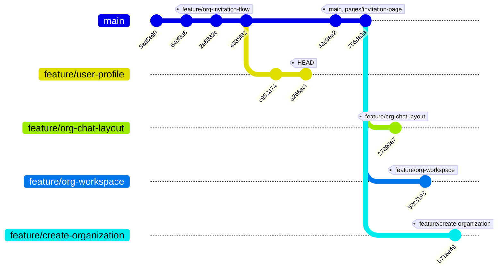

# Git Branches Overview

This document outlines the current branch structure, what each branch contains, and how they branch off from each other.

## Branch Tree Structure

### Text / Terminal View

```text
* b71ee49 (feature/create-organization) created the /create-organization for creating new organization
| * 52c3193 (feature/org-workspace) feat: implement organization workspace shell and meeting dashboard UI
| * 27890e7 (feature/org-chat-layout) feat: implement organization workspace shell
|/  
* 756da3a (main, pages/invitation-page) updated .md files for the Join Organization and Create Organization Buttons
* 48c9ee2 added the Join Organization and Create Organization Buttons and pop for inserting the Invite Code.
| * a266acf (HEAD -> feature/user-profile) added chnages to .md only
| * c952d74 feat: implement organization invitation and join flow UI
|/  
* 4035f82 Add global notification center
* 2e6832c (feature/org-invitation-flow) feat: build dashboard shell and organization workspace foundation
* 64cf3d6 feat: bootstrap React app with Vite, TypeScript, Tailwind, and initial layout
* 8ad5e90 docs: add initial project overview and architecture
```

### Mermaid View (Graph)



## Branch Details

### `main`
* **Base Branch:** Primary trunk of the repository.
* **Contains:** The foundational Vite, React, and Tailwind setup. It includes early routing, the global notification center, and recently added UI buttons/modals for "Join Organization" and "Create Organization" (including the invite code pop-up). 
* **Note:** The branch `pages/invitation-page` points exactly to the latest commit on `main`.

### `feature/org-invitation-flow`
* **Branched from:** `main` (early history)
* **Contains:** The initial commit building the dashboard shell and organization workspace foundation. 
* **Note:** This branch's history has already been incorporated into `main`.

### `feature/user-profile` (Current Active Branch)
* **Branched from:** `main` (at commit `4035f82` prior to the recent Join/Create UI buttons)
* **Contains:** Implementation of the UI for the organization invitation and join flow, as well as some minor documentation (`.md` file) updates.

### `feature/org-chat-layout`
* **Branched from:** `main` (at the latest commit `756da3a`)
* **Contains:** Code dedicated to implementing the organization workspace shell with a focus on the chat layout architecture.

### `feature/org-workspace`
* **Branched from:** `main` (at the latest commit `756da3a`)
* **Contains:** Implementation of the broader organization workspace shell and the meeting dashboard UI. 

### `feature/create-organization`
* **Branched from:** `main` (at the latest commit `756da3a`)
* **Contains:** The newly created `/create-organization` route/page designed specifically for handling the "create a new organization" user flow.
